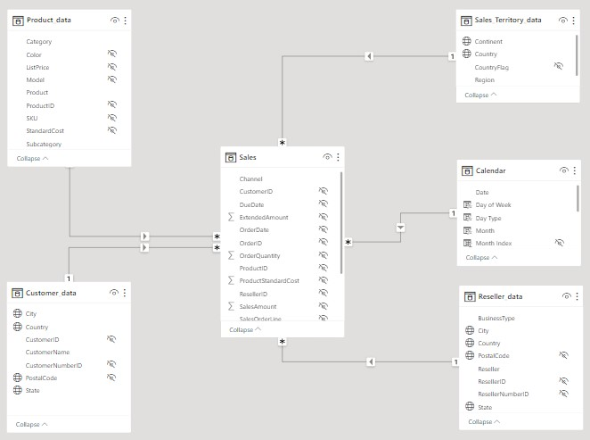
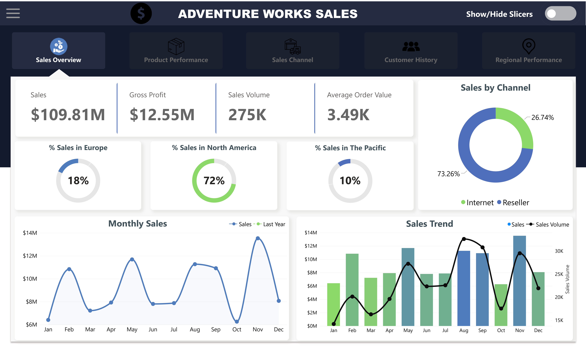
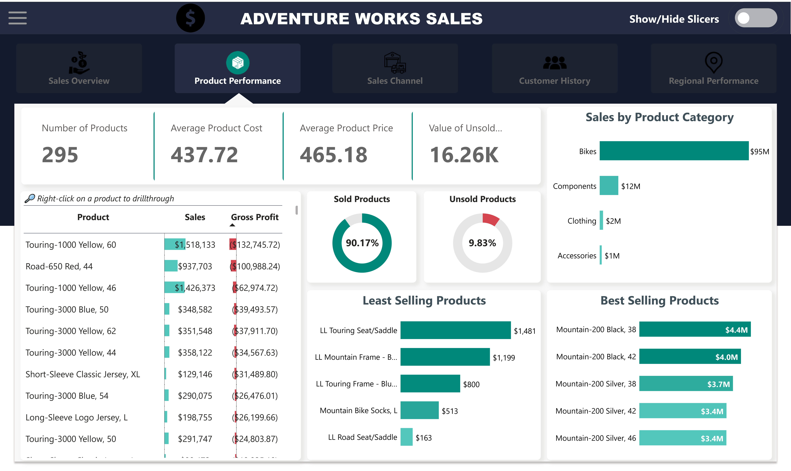
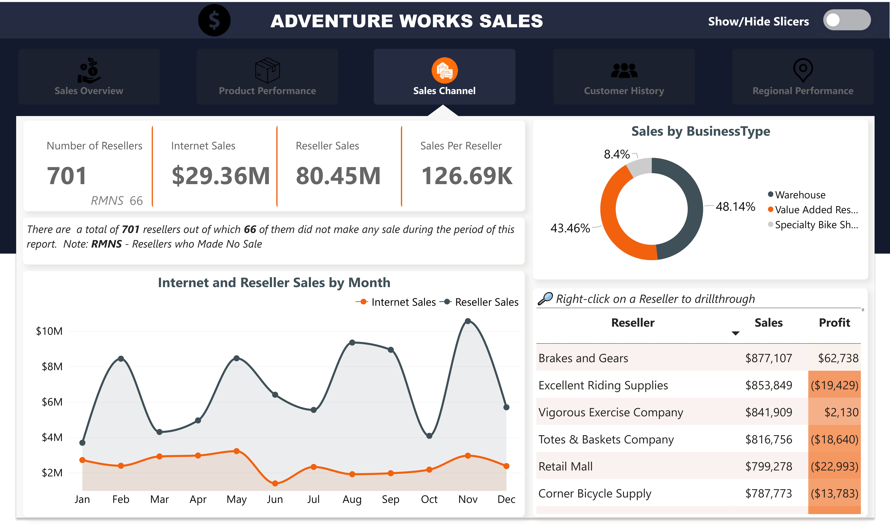
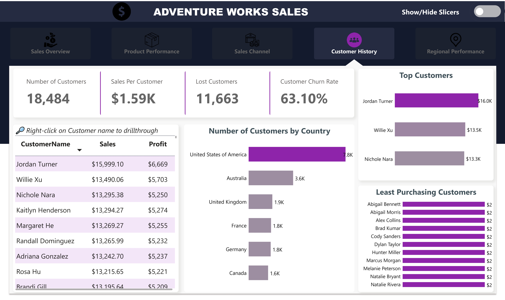
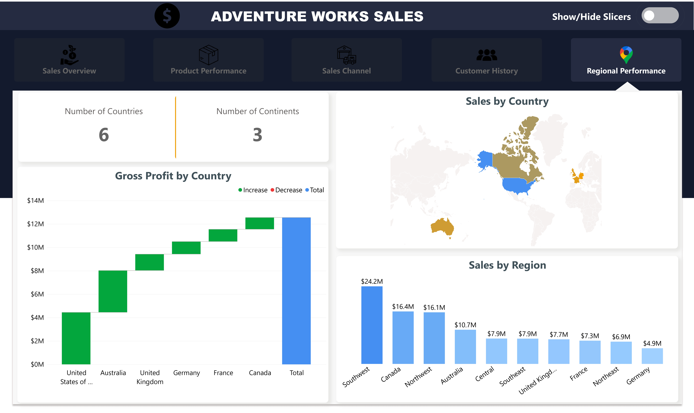

# Analyzing Data for Adventure Works

## Introduction
In the ever-evolving landscape of business and commerce, data has become the compass guiding organizations toward success. The ability to extract actionable insights from data is no longer a luxury but a necessity. In pursuing data-driven excellence, Adventure Works, a dynamic and forward-thinking company, is an exemplary case study.

Adventure Works, a fictional company, embodies modern business challenges. With a diverse product line, a global customer base, and many operational facets, it faces the complex task of optimizing its operations, enhancing customer satisfaction, and maximizing profitability. This journey begins with the Adventure Works dataset — a treasure trove of information encompassing sales transactions, product details, customer demographics, and more. Within this data lies the potential to uncover hidden patterns, identify opportunities, and make informed decisions that can propel the company forward.

The Adventure Works Data Analysis explores this rich dataset, aimed at unearthing valuable insights, improving operational efficiency, and empowering decision-makers with the knowledge they need to thrive in today’s competitive landscape. This documentation will serve as a comprehensive guide, detailing the methods, tools, and findings from this analysis.

As I embark on this adventure, I invite you to delve into the world of data analysis and join me on a journey toward data-driven excellence in Adventure Works. Together, we will unravel the story within the data and chart a course toward informed, data-backed decisions that can potentially transform business outcomes.

## Problem Statement
Adventure Works is encountering several critical challenges, including:
- How can Adventure Works boost its sales revenue by identifying sales channel(s)?
- Are there underperforming products or categories that need attention or should be discontinued?
- Which regions and customers have high or low sales?
- The sales manager reported a tremendous increase in 2019 sales. Can we see if there’s a wide divergence in sales between 2019 and the previous year?

## Skills Demonstrated 
The Adventure Works Data Analysis project demonstrates a range of skills and competencies, including:

**Data Analysis:** Employed advanced data analysis techniques to sift through vast datasets, extract meaningful insights, and identify actionable patterns.

**Data Cleaning:** Used SQL (MSSQL Server) to address data quality issues such as missing values, outliers, and duplicates to ensure the accuracy and reliability of our analysis.

**Data Visualization:** Used a data visualization tool like Microsoft Power BI to present findings effectively, making complex information accessible to a broad audience.

**Data Modeling:** Built a relationship model within Power BI to connect the various tables available for the analysis.

**Data Analysis Expression (DAX):** Complex concepts were simplified with codes written in DAX.

**Problem-Solving:** Tackled complex business problems by breaking them down into analyzable components and proposing data-driven solutions.

## Data Sourcing
This analysis is rooted in the Adventure Works dataset, a comprehensive and invaluable source of information. This dataset encompasses various facets of the company’s operations and includes:

**Sales Data:** Historical records of sales transactions, including the amount each product was sold, dates, and quantity sold.

**Customer Data:** Demographic information about customers, including Name, location, and customer ID number.

**Product Data:** Detailed information about the product catalog, including product categories, names, sub-categories, and product costs.

**Sales Territory Data:** Information about different locations where sales were recorded.

**Sales Order Data:** Detailed information about each order, including order ID and sales channel.

**Reseller Data:** Demographic information about resellers, including Name, location, and resellers’ ID number.

The data was downloaded from Kaggle's website. Click [here](https://docs.google.com/spreadsheets/d/1V9W6WwvTRTRyNCcEcthZTtCOp8qen7dS/edit?rtpof=true&sd=true) to access the dataset.

## Data Transformation 
Before diving into analysis, it’s crucial to prepare the data for exploration and modeling. Data transformation plays a pivotal role in this process. The SQL for the data cleaning and transformation (ETL) can be found [here](AW_Data_Cleaning.sql). The data transformation steps were performed in SQL and they include:

- Addressed data quality issues such as missing values and duplicates to ensure the accuracy and reliability of the analysis.
- Removing irrelevant rows and redundant columns from the dataset.
- Renaming tables and columns to meaningful column names.
- Merging redundant tables.
- Convert dates to the appropriate data type.

## Data Modeling
The relationship diagram below illustrates the interconnectedness of the various data sources and tables within the Adventure Works dataset. In addition to the five tables, I calculated a calendar table to hold dates and related information. This diagram provides a visual representation of how different data elements relate to each other, forming the foundation for our data analysis and modeling efforts.

## Data Visualization
Effective data analysis and visualization are essential to uncover meaningful insights and convey them to stakeholders. During the course of this analysis, the visuals were created with each page matching the corresponding color menu icon. 
The report comprises five pages:
- Sales Overview
- Product Performance
- Sales Channel
- Customer History
- Regional Performance

Click [here](https://app.powerbi.com/view?r=eyJrIjoiNjZhODg3ZTUtZjZmMi00MjBmLTgzYmEtYzU2OGUxYmIyNDU2IiwidCI6ImM4N2JkODljLTlmOGMtNDJlNS05NzVkLWQ3ZWYwOWI2OTIxMiJ9) to interact with the dashboard.

**_Features_**

- There are page navigators at the top of the dashboard, when clicked, redirects to the appropriate page.
- The Menu button at the top left corner displays tabs that either redirects to Sales Growth, Sales Calendar or Trends.
- There is a Toggle Button at the top right corner which displays slicers when toggled **ON**.

**_Key Notes_**
- Lost Customers in this analysis, are defined as customers who did not make any purchase in the last three months.
- Unsold Products are products that were not sold during the period of the analysis.

## Analysis
### Sales Overview
- The key performance indicators have been presented, with the business generating about $110 million in sales and a profit of about $13 million. 
- North America had the highest Sales followed by Europe and the Pacific respectively.

 **_How can Adventure Works boost its sales revenue by identifying sales channel(s)?_**
- Resellers accounted for 73.26%  as opposed to 26.74% for internet Sales.

**_Can we see if there’s a wide divergence in sales between 2019 and the previous year?_**
- Sales increase tremendously in 2019 compared to the previous year (2018). Although sales dropped in February of the previous year.
---

### Product Performance

- The product performance shows that there are a total of 295 distinct products, with each costing about $438 on average.
- 10% percent of those products were not sold in that period amounting to $16K.

**_Are there underperforming products or categories that need attention or should be discontinued?_**

- At $4,400,593, Mountain-200 Black, 38 had the highest Sales. The top 5 products all generated sales above $3 million. 
- Across all bottom 5 products, Sales ranged from $163 to $1,481.
- Bikes accounted for 86.17% of Sales. Bikes had the highest Sales, followed by Components, Clothing, and Accessories.

---

### Sales Channel

- AdventureWorks made more sales through resellers than they did through the internet.
- Warehouse Resellers had the highest Sales at $38,726,913, followed by Value Added Resellers at $34,967,517 and Specialty Bike Shop at $6,756,166.

---

### Customer History

- The company had more than 18K customers while losing about 12K.
- The majority of these customers are located in the United States of America and Australia.

**_Which customers have high or low sales?_**
- Jordan Turner accounted for 37.39% of Sales.
- All the bottom, 11 Customers made Sales of $2.

---

### Regional Performance

- The company operates in six countries spread across three continents.
- The United States of America accounted for the majority of profit with over $4 million made.

**_Which regions have high or low sales?_**
- At $24,184,610, Southwest had the highest Sales and was 395.76% higher than Germany, which had the lowest Sales at $4,878,300.
- Southwest accounted for 22.02% of Sales.

## Recommendations
Based on the analysis, we offer the following recommendations to drive Adventure Works towards data-driven excellence:

- **Segmented Marketing:** Implement targeted marketing campaigns tailored to specific customer segments identified as high-potential like Australia and the United States of America.

- **Product Strategy:** Reevaluate the performance of underperforming products and consider product improvements or discontinuation.

- **Market Expansion:** Explore expansion opportunities in identified untapped markets and regions.

- **Pricing Strategy:** Implement a standard pricing for all products. The price of products should be higher than the cost price.

- **Customer-Centric Approach:** Prioritize customer satisfaction and retention strategies based on customer insights.
 
